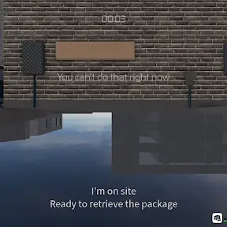

# Troubleshooting

## Enabled Touchscreen

Loading in fails on some (but not all) maps similar to this:

The cause of this was an update that broke games for users with their touchscreen enabled on Windows.

To fix this, open Device Manager, expand the subset “Human Interface Device”, then look for a touchscreen device and disable it.

Be careful when doing this—you might disable your mouse or keyboard, in which case either move the mouse or use the tab key to re-enable them.

If you would like to help us sample the significance of this issue, please vote on this [YouTube post](https://youtube.com/post/Ugkx5tl-qY86rPMqCHyR0DWru_tDK9RdAM3i).